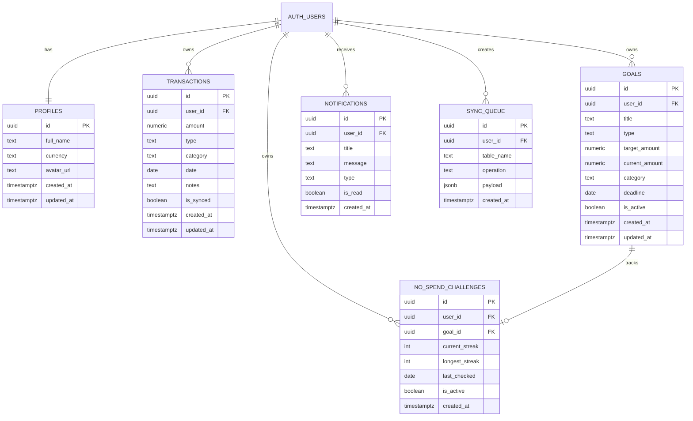

# Perfyn

Perfyn is a Flutter-based personal finance companion mobile app built for the Personal Finance Companion Mobile App assignment. It is designed as a lightweight daily money tracker rather than a banking app, with a focus on mobile-first UX, clean architecture, practical insights, and offline-friendly behavior.

## Project Overview

Perfyn helps users:

- track income and expense transactions
- understand balance, income, expenses, and savings progress
- create savings, budget, and no-spend goals
- view weekly and monthly spending insights
- use the app with local persistence and backend sync

This project was built to reflect both product thinking and implementation quality. The app emphasizes clarity, polish, and everyday usability over unnecessary feature bloat.

## Assignment Coverage

### 1. Home Dashboard

Implemented with:

- current balance
- total income
- total expenses
- savings rate
- weekly spending chart
- recent transactions preview

### 2. Transaction Tracking

Implemented with:

- add transaction
- quick add flow
- transaction history
- edit transaction
- delete transaction
- amount, type, category, date, and notes fields

### 3. Goal / Challenge Feature

Implemented through the goals module:

- savings goals
- budget goals
- no-spend challenges
- progress tracking
- goal detail and progress updates

### 4. Insights Screen

Implemented with:

- biggest spending category
- monthly totals
- weekly comparison
- category breakdown
- category drill-down screen

### 5. Smooth Mobile UX

Included in the app:

- splash screen
- onboarding flow
- bottom tab navigation
- auth flow with login, signup, forgot password, and reset password
- pull to refresh on major screens
- loading, empty, and error states
- touch-friendly mobile layouts

### 6. Local Data Handling / API Integration

Implemented with:

- Drift + SQLite for local persistence
- Supabase Auth for user authentication
- Supabase tables for synced remote data
- sync queue for offline-first mutation handling
- connectivity-aware queue flushing

### 7. Code Structure And State Management

Implemented with:

- Flutter + Dart
- feature-based folder structure
- Riverpod for state and async data handling
- GoRouter for navigation and auth-aware redirects
- repository/provider separation for cleaner business logic

## Implemented Features

### Authentication

- onboarding before first sign in
- email/password signup
- name capture during signup
- email/password login
- forgot password request flow
- reset password screen from deep link callback
- custom user-friendly auth errors
- profile name and email display

### Dashboard

- personalized greeting
- balance summary
- income and expense overview
- savings progress indicator
- weekly chart
- recent transaction list

### Transactions

- add, edit, and delete transactions
- quick add bottom sheet
- transaction history view
- categorized entries
- notes and date support

### Goals

- create goals
- savings goal support
- budget goal support
- no-spend challenge support
- goal detail page
- progress update actions

### Insights

- category analysis
- top spending driver
- weekly comparison
- monthly overview
- category drill-down

### Secondary Screens

- settings/profile screen
- notifications screen
- drawer profile summary

## Tech Stack

- Flutter
- Dart
- Flutter Riverpod
- GoRouter
- Supabase
- Drift
- SQLite
- Shared Preferences
- FL Chart
- Connectivity Plus

## Architecture Overview

### Routing

- `GoRouter` with auth-aware redirects
- onboarding gate before auth
- protected screen handling
- password recovery route handling

### State Management

- Riverpod `Provider`
- `StateNotifierProvider`
- `StreamProvider`
- `FutureProvider`

### Data Flow

- local Drift tables drive reactive UI updates
- repositories manage persistence and sync logic
- queued writes support offline-first usage
- Supabase acts as auth provider and remote backend

## Data Strategy

Perfyn follows a practical local-first architecture:

1. The app writes and reads from local SQLite through Drift.
2. Screens subscribe to local streams for responsive UI updates.
3. Mutations are queued when they need to sync remotely.
4. Supabase stores auth state and synced records.
5. When connectivity returns, queued writes are flushed.

This approach aligns well with the assignment's flexibility around local storage or backend integration while still showing a stronger real-world sync model.

## Database Design

The app uses Supabase-backed tables together with local Drift tables for offline-first behavior.

### ER Diagram



### Relationship Summary

- `profiles.id` is a one-to-one extension of `auth.users.id`
- one user can have many `transactions`
- one user can have many `goals`
- one user can have many `notifications`
- one user can have many `sync_queue` records
- a no-spend challenge belongs to one goal and one user

## Supabase Schema

### `profiles`

```sql
create table profiles (
  id            uuid primary key references auth.users(id) on delete cascade,
  full_name     text,
  currency      text default 'INR',
  avatar_url    text,
  created_at    timestamptz default now(),
  updated_at    timestamptz default now()
);
```

### `transactions`

```sql
create table transactions (
  id          uuid primary key default gen_random_uuid(),
  user_id     uuid references auth.users(id) on delete cascade not null,
  amount      numeric(12, 2) not null check (amount > 0),
  type        text not null check (type in ('income', 'expense')),
  category    text not null,
  date        date not null,
  notes       text,
  is_synced   boolean default true,
  created_at  timestamptz default now(),
  updated_at  timestamptz default now()
);
```

### `goals`

```sql
create table goals (
  id              uuid primary key default gen_random_uuid(),
  user_id         uuid references auth.users(id) on delete cascade not null,
  title           text not null,
  type            text not null check (type in ('savings', 'budget', 'no_spend')),
  target_amount   numeric(12, 2),
  current_amount  numeric(12, 2) default 0,
  category        text,
  deadline        date,
  is_active       boolean default true,
  created_at      timestamptz default now(),
  updated_at      timestamptz default now()
);
```

### `no_spend_challenges`

```sql
create table no_spend_challenges (
  id              uuid primary key default gen_random_uuid(),
  user_id         uuid references auth.users(id) on delete cascade not null,
  goal_id         uuid references goals(id) on delete cascade not null,
  current_streak  int default 0,
  longest_streak  int default 0,
  last_checked    date,
  is_active       boolean default true,
  created_at      timestamptz default now()
);
```

### `notifications`

```sql
create table notifications (
  id          uuid primary key default gen_random_uuid(),
  user_id     uuid references auth.users(id) on delete cascade not null,
  title       text not null,
  message     text not null,
  type        text check (type in ('budget_alert', 'goal_milestone', 'streak_reminder')),
  is_read     boolean default false,
  created_at  timestamptz default now()
);
```

### `sync_queue`

```sql
create table sync_queue (
  id            uuid primary key default gen_random_uuid(),
  user_id       uuid references auth.users(id) on delete cascade not null,
  table_name    text not null,
  operation     text check (operation in ('insert', 'update', 'delete')),
  payload       jsonb not null,
  created_at    timestamptz default now()
);
```

## Local Database Notes

In the Flutter app, local Drift tables are used for:

- transactions
- goals
- sync queue

These local tables support offline reads, optimistic writes, and queued sync behavior before data reaches Supabase.

## Project Structure

```text
lib/
  app/
    app.dart
    presentation/
    providers/
  core/
    database/
    network/
    router/
    theme/
  features/
    auth/
    dashboard/
    goals/
    insights/
    notifications/
    settings/
    transactions/
  shared/
    constants/
    extensions/
    widgets/
```

## Setup

### Prerequisites

- Flutter SDK
- Dart SDK
- Android Studio or VS Code with Flutter tooling
- a Supabase project

### Environment Variables

Create `assets/.env` with:

```env
SUPABASE_URL=your_supabase_url
SUPABASE_ANON_KEY=your_supabase_anon_key
```

### Install Dependencies

```bash
flutter pub get
```

### Run The App

```bash
flutter run
```

## Product Decisions And Assumptions

- The app is a finance companion, not a banking app.
- Email/password auth was selected for a straightforward mobile onboarding flow.
- INR is currently the default currency in the UI and schema.
- The goals feature was extended into savings, budget, and no-spend modes to better satisfy the assignment's product-thinking requirement.
- Offline-first sync was prioritized to make the app feel more reliable on mobile.
- Notifications and settings are included as supporting enhancements.

## Optional Enhancements Included

- onboarding flow
- notifications screen
- profile/settings screen
- auth recovery flow
- offline-aware sync queue

## Evaluation Criteria Mapping

### Product Thinking

The app is positioned as an everyday money companion with lightweight but meaningful workflows.

### Mobile UI / UX Quality

The app includes onboarding, splash, bottom navigation, form flows, pull-to-refresh, and mobile-friendly visual hierarchy.

### Creativity

The goal system combines savings goals, budget tracking, and no-spend challenges in a way that feels integrated into the product.

### Functionality

Core flows across auth, dashboard, transactions, goals, insights, and profile are implemented.

### Code Quality

The project uses organized feature folders, provider-driven state, and reusable screen/component patterns.

### State And Data Handling

The app combines local persistence, backend sync, and Riverpod-managed async state cleanly.

### Responsiveness And Device Experience

Layouts are built for mobile use with scrollable forms, cards, sheets, and tab-based navigation.

### Documentation

This README now covers the project overview, architecture, setup, assumptions, schema, and ER diagram.

## Known Limitations

- This is an assessment project, not a production-ready finance product.
- Some secondary flows such as notifications are lightweight and illustrative.
- Currency support is currently centered around INR.
- Production-grade analytics, export, advanced security hardening, and admin tooling are outside the current scope.

## Conclusion

Perfyn was built as a polished submission for the personal finance companion assignment. It demonstrates how a finance tracking idea can be translated into a coherent mobile product with strong UX fundamentals, organized state handling, local-first persistence, sync support, and a clear product direction.
